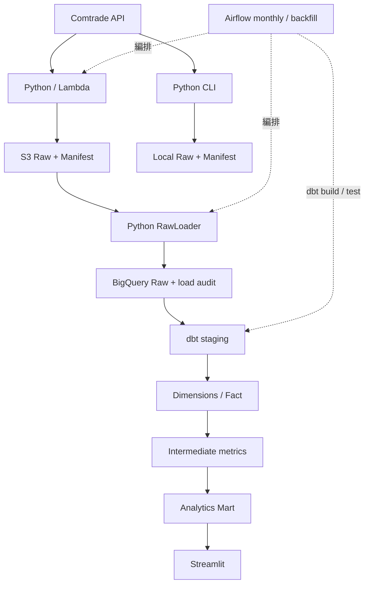
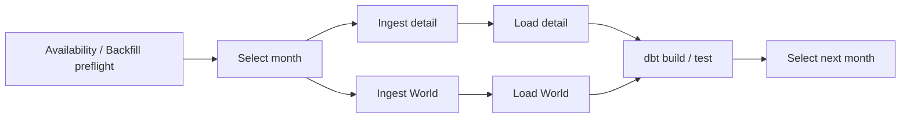

# 美國半導體進口分析

分析美國月度半導體進口金額、來源國、市占率、MoM、YoY 與 HHI。商品固定 HS 8542，分類版本 H6。

固定 reporter 842、美國月度進口；擷取 `partner_detail` 與 `world_total`，預設展示 202301～202412。

部署採手動維護 Lambda／S3；Streamlit 在本機展示。GitHub Actions 僅執行程式、DAG 與容器檢查。詳細操作見 [操作手冊](docs/runbook.md)。

## 專案架構



Python 驗證 S3 checksum、Manifest、NUMERIC 精度與 grain，再以交易式分區替換寫入 Raw。dbt 直接建立 `mart_us_semiconductor_supply_chain`，Streamlit 直接查詢該表；國家映射問題保留 audit model 以便追查。

CLI 透過 `trade-ingest` 將來源及 Manifest 寫入本機，用於除錯；入口位於 `src/trade_analytics/ingestion/cli.py`。目前 RawLoader 讀取 S3，因此 CLI 不會直接更新 BigQuery。執行方式見 [操作手冊：本機 CLI 擷取](docs/runbook.md#本機-cli-擷取)。

## 核心規格

- 十進位金額從解析到 BigQuery NUMERIC 保持精度。
- S3 保存 immutable 原檔、Manifest、checksum 與 revision，支援部分檔復原。
- Python adapter 驗證來源後，交易式替換 BigQuery Raw partition；重跑不新增重複 grain，舊 revision 不覆蓋新版。
- dbt 建立 staging、dimensions、fact、metrics 與單一 Analytics Mart。
- 指標包含市占率、MoM、YoY、HHI／覆蓋率及條件式 USD／kg。
- Streamlit 使用參數化 SQL、日期篩選、查詢量上限與快取。
- Airflow 支援月度最近三期冪等重跑、手動單月與每批最多三個月 backfill，暫時性失敗有限重試。
- 每個核心功能保留代表測試；dbt 驗證來源契約、grain、資料保留、日期完整性、指標邏輯與映射追蹤。
- Lambda container 使用 ECR、Lambda 執行角色與基本 Logs 權限；AWS 資源手動維護。

資料身份為月份 × 查詢類型 × HS 商品 × HS 版本 × revision。來源歷史放在 S3，BigQuery Raw 保存最新接受版本。來源擷取 run_id、Raw loader 識別碼與 Airflow run_id 各有用途，不應假設相同。

## 安裝與設定

Python 3.11；Airflow、dbt 使用獨立環境。

```bash
python3.11 -m venv .venv
.venv/bin/python -m pip install -e '.[dev,warehouse,dashboard]'
python3.11 -m venv .venv-dbt
.venv-dbt/bin/python -m pip install -r dbt/requirements.txt
cp .env.example .env
cp dbt/profiles.yml.example dbt/profiles.yml
```

填入 `.env` 的 AWS profile、S3 bucket、GCP project 與 Dataset；shell 操作前載入環境設定：

```bash
set -a
source .env
set +a
aws sso login --profile "$AWS_PROFILE"
gcloud auth application-default login
```

AWS 身分需可呼叫指定 Lambda 並讀取來源 S3；GCP 身分需可執行 BigQuery jobs、寫入 Raw／dbt Dataset。Dashboard 僅需 job 權限與 Analytics Mart Dataset 唯讀權限。憑證不放進 image 或 Git。

## 手動部署與首次建表

建立或沿用 S3、ECR、Lambda 與執行角色。Lambda 設定 `RAW_BUCKET`、`RAW_PREFIX=un_comtrade`，reserved concurrency 為 1。從專案根目錄建置 Lambda image，再手動推送至 ECR 並更新 Lambda：

```bash
docker buildx build --platform linux/amd64 --provenance=false --load \
  -f docker/Dockerfile.lambda -t trade-analytics-ingestion:local .
```

在 BigQuery 編輯器依序執行以下 SQL；已依目前本機設定填入 project、Raw Dataset 與 location。若換環境，先同步修改 SQL 與 `.env`。第一份 SQL 會建立 Raw Dataset：

1. [Raw tables](sql/raw-tables.sql)。
2. [Load audit](sql/audit-ingestion-runs.sql)。

目前載入採 Python adapter，直接驗證 S3 後以 BigQuery 暫存資料和交易式分區替換寫入 Raw，不需要共用 landing table 或 S3 Transfer。

## 單月流程

```bash
.venv/bin/python scripts/monthly_steps.py ingest --period 202412 --kind partner_detail --run-id manual-202412
.venv/bin/python scripts/monthly_steps.py ingest --period 202412 --kind world_total --run-id manual-202412
.venv/bin/python scripts/monthly_steps.py load --period 202412 --kind partner_detail
.venv/bin/python scripts/monthly_steps.py load --period 202412 --kind world_total
.venv/bin/python scripts/monthly_steps.py build --period 202412 --dbt-executable .venv-dbt/bin/dbt
```

同內容重跑驗證既有來源與 Raw snapshot，不新增重複 grain。來源修訂需明確使用下一個 `--revision`，S3 保留前版。dbt 建置涵蓋已接受 Raw 資料；回填較早月份不截掉後續月份。

## 本機 Streamlit

介面入口位於 `src/trade_analytics/dashboard/app.py`，BigQuery 查詢邏輯位於同目錄的 `queries.py`。啟動指令與 GCP 認證方式見 [操作手冊：啟動 Streamlit demo](docs/runbook.md#啟動-streamlit-demo)。

預設讀取 `trade_analytics.mart_us_semiconductor_supply_chain`；`TRADE_BQ_DATASET` 應與 dbt profile 一致。提供日期、Partner、Top N、金額趨勢、YoY、HHI／覆蓋率、地圖與金額／YoY 散佈圖。查詢使用參數、日期篩選與 bytes 上限；快取預設 1 小時。

展示預設 202301～202412。新增月份需同步調整 `TRADE_DASHBOARD_AFTER_LAST_MONTH`，上界不含該月；最多 60 個月。

## 本機 Airflow

首次設定、啟動、登入、Pool 設定與狀態檢查見 [操作手冊：啟動 Airflow Web UI](docs/runbook.md#啟動-airflow-web-ui)。

UI：http://localhost:8080。啟用 `trade_monthly_pipeline` 後，每月 1 日依台北時間檢查最近 3 個完整月份，依序冪等重跑可用月份。來源未提供時記錄 `not_available`。手動單月輸入 `{"period":"202412"}`；backfill DAG 輸入 `{"start_period":"202301","end_period":"202303"}`，每批最多 3 個月。

Airflow 只在本機服務運行時排程。兩個 DAG 共用 `dags/trade_pipeline/common.py` 的命令執行、task 參數、重試設定與月份依賴。`trade_pipeline` Pool 為單 slot，只允許一個 pipeline task 同時執行；各 DAG 限制單一 active run。跨 DAG 的整個月份流程仍可能交錯，手動回填時應暫停月度排程並等待既有 run 結束。

Cloud credential 只唯讀掛入 Airflow worker，XCom 僅傳 metadata。暫時性遠端錯誤最多額外重試 3 次，永久驗證錯誤不盲目重試。

### Airflow 單月任務



兩種來源都載入成功才開始 dbt，任一 task 失敗會阻擋該月後續步驟。月份依序處理；backfill DAG 僅接受手動執行。

## 品質檢查

```bash
PATH="$PWD/.venv/bin:$PATH" bash scripts/ci_checks.sh
```

包含 Ruff、mypy 與 18 個核心功能的代表性 unit tests；coverage 只輸出報告，不設百分比門檻。CI 另有真實 DAG import、Lambda Docker smoke check。dbt 的 unit／data tests 在 BigQuery 執行，可用 `scripts/test_dbt_cloud.py --help` 查看隔離 Dataset 驗證入口。

## 精簡測試範圍

Python 每個核心功能保留一個案例，共 18 個離線 unit tests，集中於 `test_ingestion.py`、`test_warehouse.py`、`test_dashboard.py`；另保留 1 個真實 Preview API integration test，預設跳過，以 `--run-integration` 啟用。

dbt 將 6 個核心 SQL 契約集中於 `assert_data_flow.sql` 與 `assert_analytics.sql`，另保留必要 grain／seed 測試，以及市占／成長／單位價值與 HHI 各一個固定輸入的 unit test。部分 schema、狀態與邊界案例已移除；精簡測試通過只表示代表情境正常。

## 驗收方式

執行 Python 品質檢查、真實 DAG import、dbt BigQuery build／tests，並驗證真實單月兩類來源與重跑、歷史月份回填後仍保留新月份，以及 Streamlit 人工核對。雲端驗收須保存真實結果，本機測試不能代替雲端驗收。

## 已知限制

- 固定美國月度進口、HS 8542／H6，預設展示 24 個月；無關稅、HTS crosswalk 或跨分類版本比較。
- Preview API 有限流與截斷檢查；空資料與永久失敗分開處理。
- S3 保留 immutable 原檔，Raw 僅保存最新接受版本與 load audit；不建立完整 warehouse history。
- Lambda concurrency、Airflow Pool 設為 1；手動操作不得與 DAG 交錯。
- Monthly 每次冪等重跑最近 3 個完整月份；更早期需人工 backfill，來源修訂需明確指定 revision。
- Airflow 只在本機服務運行時排程，`catchup=False` 不自動補完停機期間。
- dbt build／test 失敗會讓流程失敗，但不會自動回復已建立的模型。Dashboard 可能讀到此次流程已更新的部分資料，沒有 last-known-good 發布層。
- 來源缺月、無 World 分母或重量缺失以 NULL／覆蓋資訊呈現。HHI 使用 World 分母，必須搭配國家覆蓋率；分母無效時為 NULL。USD／kg 不是晶片單顆價格。
- Dashboard 日期範圍最多 60 個月，新增月份需調整環境變數；快取預設 1 小時。
- AWS 手動部署，沒有 IaC 重建或 GitHub 雲端部署流程；瘦身未改動現有雲端服務。

詳細欄位與資料規則見 [資料契約](docs/data-contract.md)及 [資料字典](docs/data-dictionary.md)。dbt 保留 unique、not_null、relationships、grain、指標邏輯與國家映射追蹤。

## 五分鐘展示流程

1. 說明 Comtrade → Lambda／S3 → BigQuery Raw → dbt Mart → Streamlit，Airflow 串接流程。
2. 在 Dashboard 選定月份與 Partner，展示金額、市占率、YoY 與 HHI，搭配國家覆蓋率說明限制。
3. 以固定 BigQuery 查詢核對一個數字，不將圖表觀察當成因果。
4. 展示同月安全重跑：S3 checksum 穩定、Raw grain 不重複，dbt 重新建立 Mart。
5. 說明 Manifest、revision、load audit 與 Airflow log 如何協助排查；dbt tests 失敗會停止流程，但不提供模型自動 rollback。

僅展示目前已實測的資料與結果。三項分析觀察須自行保存查詢條件及證據。
