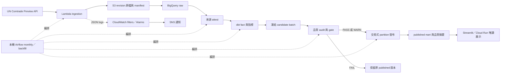
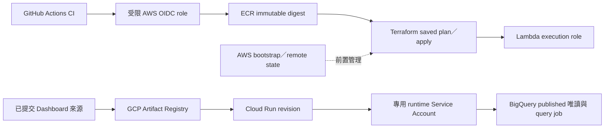

# 系統架構與設計取捨

截至 2026-10-02，作品提供美國月度進口 `8542／H6` 的來源追溯、品質發布與唯讀展示。資料版本與雲端實測見 [最終驗收](day20-final-acceptance.md)。

## 資料流與控制流

實線為資料或事件流；虛線為控制流。每月分別取得 `partner_detail` 與 `world_total`，在 load／attest 確認月份、分類、revision、checksum 與載入紀錄，避免以錯誤來源配對建置指標。Airflow 的 XCom 只傳 metadata，實體資料留在 S3／BigQuery。

## 部署與身分

AWS CI 使用限定 repository subject／`main` 的臨時身分；部署角色、Lambda execution role 與本機操作 profile 分開。Terraform bootstrap 管理 backend／OIDC 等前置設定，application 管理執行資源。Git SHA → image digest → Lambda resolved digest 有實測證據。

GCP 採既有可重做手動部署入口，未建立 WIF 或完整 GCP Terraform。Cloud Run runtime 使用綁定身分的 ADC，僅讀正式 Dataset 並執行 query jobs；部署者與 runtime 分工，不在 image 打包 JSON key。

## 保證與邊界

| 設計 | 理由與實際保證 |
|---|---|
| H6 回應驗證 | `/HS` endpoint 不保證版本；逐筆拒絕非 H6，避免混版 |
| S3 revision／checksum | 相同 revision 同內容保留原檔；衝突拒絕；來源修訂使用新 revision 保留歷史 |
| raw 交易式載入 | 載入提交後回報遺失可查 audit 並安全重試，不增加有效 grain |
| 凍結候選與 gate | 品質對應 exact batch／hash；一般 dbt build 不發布；FAIL 保留正式版本 |
| published partition 替換 | PASS／WARN 在交易內更新；同一發布 ID 安全重跑保留原 published_at |
| 單 writer | 兩條 DAG 共用一個 Pool slot、每條最多一個 run；不保證任意外部多 writer 安全 |
| 唯讀展示 | 訪客僅使用有限篩選／固定參數化 SQL，不能寫資料或提交任意 SQL |
| 可觀測性 | 原生 Alarm 不含 run ID；由 Alarm 時間／函數找到 request／run ID，再追查 manifest、load、audit |

服務 image 回復不撤銷已發布資料。Cloud Run 實測復原採舊 digest 建立新 revision，直接舊 revision 回切失敗保留。Monthly DAG 已恢復並自動發布 202607；本機服務停機時不執行排程。長期驗收仍待手動觀察，見 [營運紀錄](continuous-operations-record.md)。更多界線見 [限制](known-limitations.md)與 [操作索引](runbook.md)。
